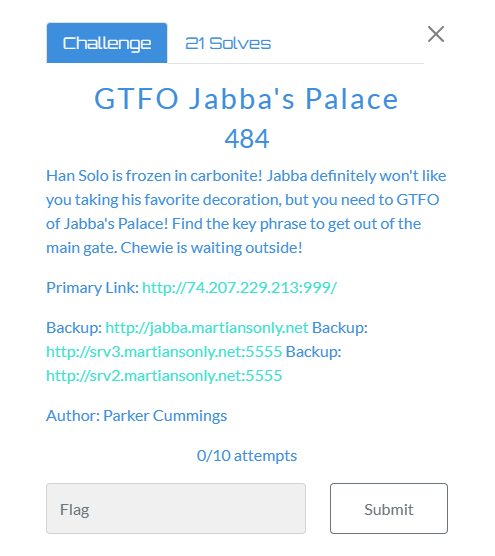
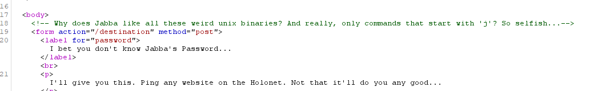
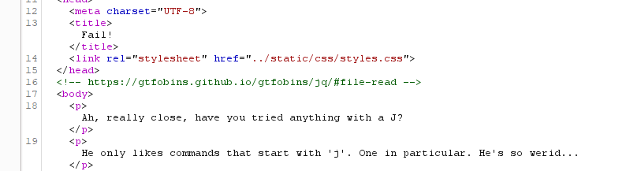
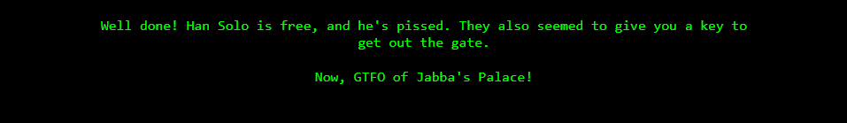
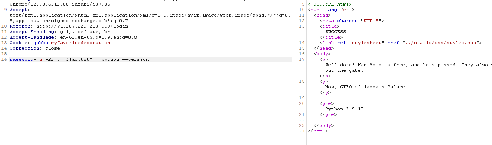
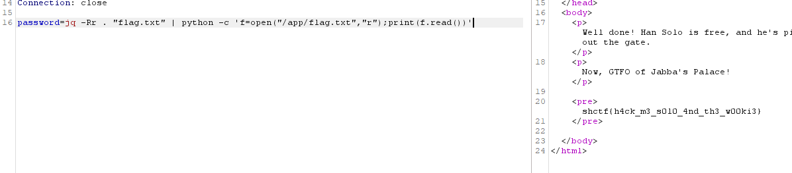

# GTFO Jabba's Palace Web Writeup

### Website: http://jabba.martiansonly.net

## Description:



Han Solo is frozen in carbonite! Jabba definitely won't like you taking his favorite decoration, but you need to GTFO of Jabba's Palace! Find the key phrase to get out of the main gate. Chewie is waiting outside!

Author: Parker Cummings

## Solution:

### Step 1:


While examining the website content, a curious thought struck me: perhaps the endpoint leads to chocolate, though the reasoning eluded me. Fatigue setting in, I yearned for some rest.

After getting 


After loading it into Burp and conducting a thorough examination of the code, a peculiar detail stood out: the presence of a cookie dubbed 'myfavoritedecoration.' Sensing an opportunity, I decided to experiment with it, and to my surprise, it yielded results. The correlation between this cookie and the user session hinted at its probable usage as the authentication username.

``` 
found from cookie after incorrect text 
Set-Cookie: jabba=myfavoritedecoration

user=myfavoritedecoration
```

### Step 2:

After being redirected to this particular page...


I decided to experiment with random text to gauge its effect.


Unfortunately, the random text didn't yield any success. However, while examining the code in Burp, I discerned a clue pointing towards a command beginning with 'j'.





However, the code also provided a hint indicating it was a jq command. Armed with this insight, I enlisted the help of my more adept teammates, and together we formulated a solution.

 ``` jq -Rr . "flag.txt" ```



Which, as it turned out, worked flawlessly.

```
pass:jq -Rr . "flag.txt"
```

However, to our dismay, no flag appeared despite our efforts. Even attempting to pipe 'ls' proved fruitless and the website promptly rebuffed our attempt with the message: 'No reading for you! Jabba's smarter than that.' We speculated on potential reasons for this setback, perhaps Jabba had implemented additional safeguards or the command we tried was not correctly formatted.


### Step 3:

After experimenting with various commands for about 30 minutes to an hour, we decided to check if Python was installed and what it would do. Here's what happened...



So once again, one of the more resourceful members of our team devised this command: ``` jq -Rr . "flag.txt" | python -c 'f=open("/app/flag.txt","r");print(f.read())' ```

This command leveraged the jq tool to read the contents of "flag.txt" and then utilized Python to print out the contents. And lo and behold, it worked!"



### Executed Text: 
```bash
jq -Rr . "flag.txt" | python -c 'f=open("/app/flag.txt","r");print(f.read())'
```

## Flag: shctf{h4ck_m3_s0l0_4nd_th3_w00ki3}
## Kyle Helped (*Insert Github plug Here*)