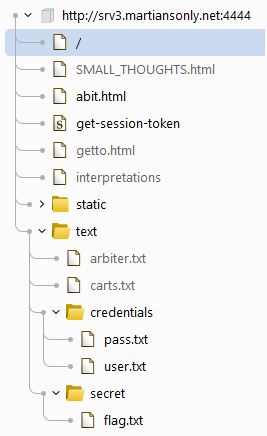
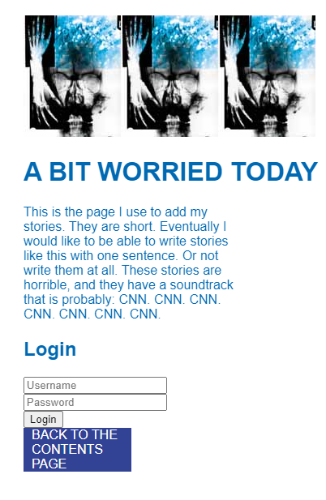
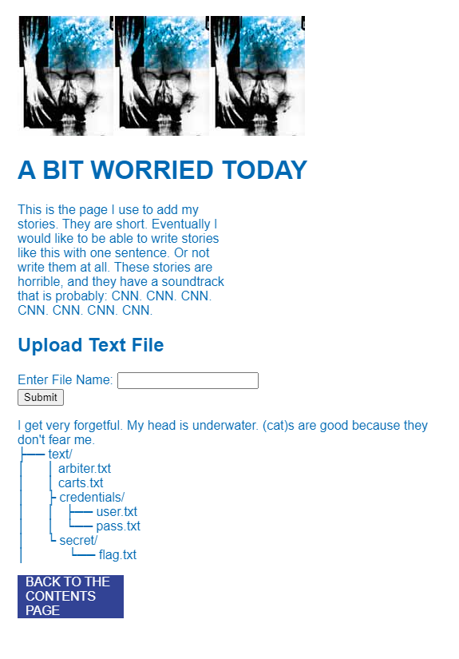
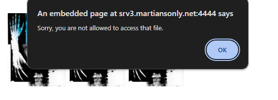
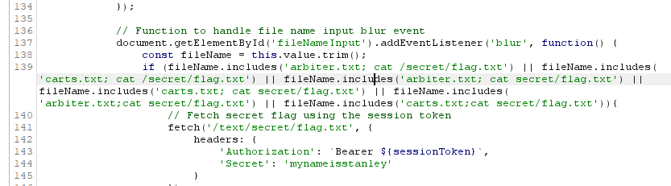
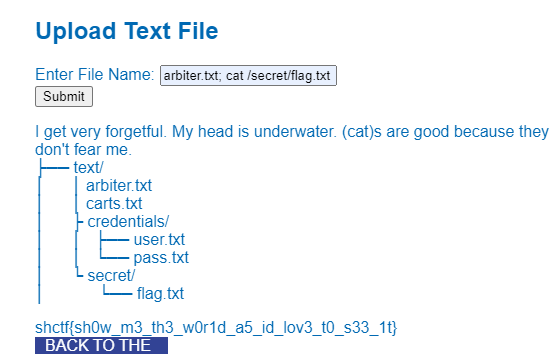

# Slowly downward Web Writeup

### Website: http://slow.martiansonly.net/

## Description:


We've found what appears to be a schizophrenic alien's personal blog. Poke around and see if you can find anything interesting.

Author: liabell (https://github.com/Liabell)

## Solution:

### Step 1:


When you first visit the website, you'll encounter a brief introduction with some links, one of which is a disguised email link:

```html
mailto:stanleydonwood
```

Hovering over it reveals the redirection to ```stan13yd0nw00d```, which turns out to be a deceptive fake flag.

Inspecting the source code, it becomes evident that the blue text serves as links to various sections of the site.

Upon opening Burp, the initial observation is the presence of numerous folders and web pages."



### Step 2:

After thoroughly examining all the links, I found that user.txt and pass.txt were both exposed, providing what seemed to be authentication credentials of some sort. Furthermore, when I visited abit.html, I discovered that this page offered a login feature.



The discovered credentials were...
```
http://srv3.martiansonly.net:4444/text/credentials/user.txt
http://srv3.martiansonly.net:4444/text/credentials/pass.txt

user:4dm1n
pass:p4ssw0rd1sb0dy5n4tch3r5
```

```
http://srv3.martiansonly.net:4444/abit.html 
```

Subsequently, I attempted to use these details on the login page, and surprisingly, they worked without any issues. ¯\_(ツ)_/¯



### Step 3:

Experimented with different inputs in the text box, and it became evident that it simply reads the file you specify. However, attempting to access 'secret/flag.txt' resulted in a denial of access.



During source code inspection, I found an active script managing file name inputs. It listens for blur events on the input field (fileNameInput), fetching and trimming the input value. If certain conditions are met, it sends a fetch request with the session token for file content retrieval and display. Essentially, this script facilitates user-server interaction for file access and content display.

```js
 // Function to handle file name input blur event
            document.getElementById('fileNameInput').addEventListener('blur', function() {
                const fileName = this.value.trim();
                if (fileName.includes('arbiter.txt; cat /secret/flag.txt') || fileName.includes('carts.txt; cat /secret/flag.txt') || fileName.includes('arbiter.txt; cat secret/flag.txt') || fileName.includes('carts.txt; cat secret/flag.txt') || fileName.includes('arbiter.txt;cat secret/flag.txt') || fileName.includes('carts.txt;cat secret/flag.txt')){
                    // Fetch secret flag using the session token
                    fetch('/text/secret/flag.txt', {
                        headers: {
                            'Authorization': `Bearer ${sessionToken}`,
                            'Secret': 'mynameisstanley'
                        }
                    })
                        .then(response => {
                            if (!response.ok) {
                                throw new Error('File not found.');
                            }
                            return response.text();
                        })
                        .then(fileContent => {
                            document.getElementById('fileContent').innerText = fileContent;
                        })
                        .catch(error => {
                            alert(error.message);
                        });
                } else if (fileName.includes('carts.txt; cat arbiter.txt') || fileName.includes('carts.txt;cat arbiter.txt') || fileName.includes('arbiter.txt; cat arbiter.txt') || fileName.includes('arbiter.txt;cat arbiter.txt')) {
                    fetch('/text/arbiter.txt', {
                        headers: {
                            'Authorization': `Bearer ${sessionToken}`
                        }
                    })
                        .then(response => {
                            if (!response.ok) {
                                throw new Error('File not found.');
                            }
                            return response.text();
                        })
                        .then(fileContent => {
                            document.getElementById('fileContent').innerText = fileContent;
                        })
                        .catch(error => {
                            alert(error.message);
                        });
                }
                else if (fileName.includes('arbiter.txt; cat carts.txt') || fileName.includes('arbiter.txt;cat carts.txt') || fileName.includes('carts.txt; cat carts.txt') || fileName.includes('carts.txt;cat carts.txt')) {
                    fetch('/text/carts.txt', {
                        headers: {
                            'Authorization': `Bearer ${sessionToken}`
                        }
                    })
                        .then(response => {
                            if (!response.ok) {
                                throw new Error('File not found.');
                            }
                            return response.text();
                        })
                        .then(fileContent => {
                            document.getElementById('fileContent').innerText = fileContent;
                        })
                        .catch(error => {
                            alert(error.message);
                        });
                }
                else if (fileName.includes('flag.txt')) {
                    alert('Sorry, you are not allowed to access that file.');
                    this.value = '';
                } else {
                    if (fileName !== '') {
                        // Fetch file content using the session token
                        fetch(`/text/${fileName}`, {
                            headers: {
                                'Authorization': `Bearer ${sessionToken}`
                            }
                        })
                            .then(response => {
                                if (!response.ok) {
                                    throw new Error('File not found.');
                                }
                                return response.text();
                            })
                            .then(fileContent => {
                                document.getElementById('fileContent').innerText = fileContent;
                            })
                            .catch(error => {
                                alert(error.message);
                            });
                    } else {
                        alert('Please enter a file name.');
                    }
                }
            });
```

### Step 4:

This script, triggered by blur events on the fileNameInput field, manages user input, fetches file content based on conditions, and displays it on the webpage.



```js
if (fileName.includes('arbiter.txt; cat /secret/flag.txt')
```

I entered "arbiter.txt; cat /secret/flag.txt" into the box, and it worked flawlessly.. Happy days



### Executed Text: 
```bash
arbiter.txt; cat /secret/flag.txt
```

## Flag: shctf{sh0w_m3_th3_w0r1d_a5_id_lov3_t0_s33_1t}
