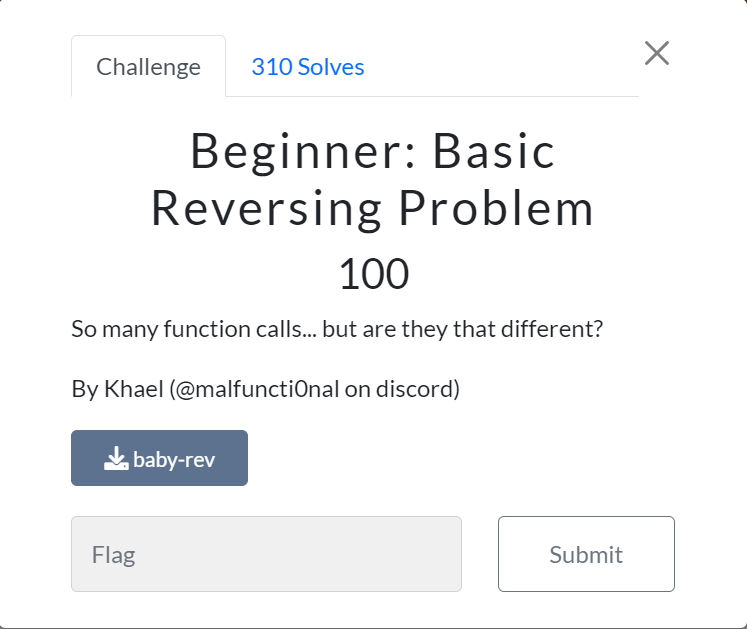

# Beginner - Basic Reversing Problem

## Description:


So many function calls... but are they that different?

By Khael (@malfuncti0nal on discord)

## Solution:
### Step 1:

I opened up the file in Ghidra, and looked up the main function,


### Step 2:


### Step 3:


### Step 4:


### Executed Command: 
```powershell 

$hexString = "75 74 66 6c 61 67 7b 69 5f 63 34 6e 5f 63 34 6e 5f 72 33 76 21 7d"
$asciiChars = $hexString -split ' ' |ForEach-Object {[char][byte]"0x$_"}
$asciiString = $asciiChars -join ''
$asciiString

```

## Flag: utflag{i_c4n_r3v!}
